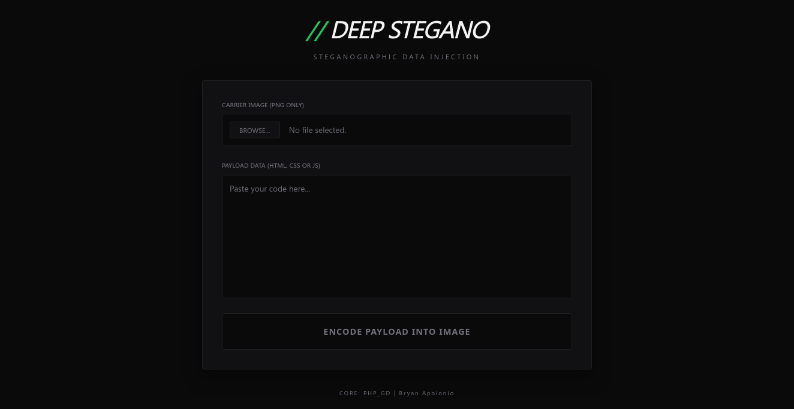

# Simple Stegano Engine

A pixel-level data concealment system that transforms static images into self-contained web applications.

<p align="center">
  
</p>

## Overview

**Simple Stegano Engine** is an advanced implementation of **LSB (Least Significant Bit)** steganography. It allows developers to inject entire payloads (HTML/CSS/JS) into the spatial domain of a PNG file.

The core philosophy is **Functional Stealth**: the image serves as the carrier, the database, and the interface simultaneously. When accessed through the provided loader, the binary stream is reconstructed in the client-side buffer and rendered instantly.

## Prerequisites

To generate your own carriers or run the loader, you need:

  * **PHP 8.1+** (for the Encoder)
  * **PHP Extensions:** `php-gd` (essential for pixel manipulation)
  * **Modern Browser:** Support for `Canvas API` and `async/await` (for the Decoder)

## Setup & Configuration

### 1. The Payload Injection
Input your HTML/CSS/JS source into the encoder. The PHP engine will generate a `fragment.png`. **Crucial:** The file must be handled as a Lossless asset to maintain bit-stream integrity.

### 2. The Decoder Logic
The recovery engine is environment-agnostic. Define your carrier's location (local path or remote URL) within the configuration script:

```javascript
// decoder/assets/js/script.js
const imageSource = 'https://your-cdn.com/assets/fragment.png'; // Remote URL Example
// const imageSource = '../fragment.png';                      // Local Path Example
```

### 3. Usage & Deployment
The carrier image functions as a standard asset. It can be served from any Web Server, CDN, or Cloud Storage. To integrate the visual component into any markdown-supported environment (Portfolios, Documentation, or Blogs), use the standard reference:

```markdown

```

## Installation (Backend Encoder)

### Ubuntu/Debian

```bash
sudo apt install php-cli php-gd -y
```

### macOS

```bash
brew install php
```

## Project Structure

```text

├── index.php               # THE ENCODER: PHP LSB Injection Engine
├── assets/
│   ├── css/
│   │   └── style.css       # Styles for the Encoder Interface
│   └── img/
│       └── encoder.png        # UI Screenshot: Encoder View
└── decoder/                # THE DECODER: Standalone Recovery Environment
    ├── index.html          # Entry point for data extraction
    └── assets/
        ├── css/
        │   └── style.css   # Styles for the Loader/Landing
        └── js/
            └── script.js   # Recovery Logic & Image Configuration
```

## Technical Constraints

  - **Format Rigidity:** Only PNG is supported. Converting to JPEG or WebP will result in total data corruption due to lossy compression.
  - **Capacity:** Maximum payload size is determined by `(Width * Height * 3) / 8` bytes.
  - **CORS Policy:** If the carrier image is hosted on a different domain than the loader, the server MUST provide appropriate `Access-Control-Allow-Origin` headers, and the script must set `img.crossOrigin = "Anonymous"`.

**Disclaimer:** This tool is for educational purposes and research into steganography and data concealment. Use responsibly.
